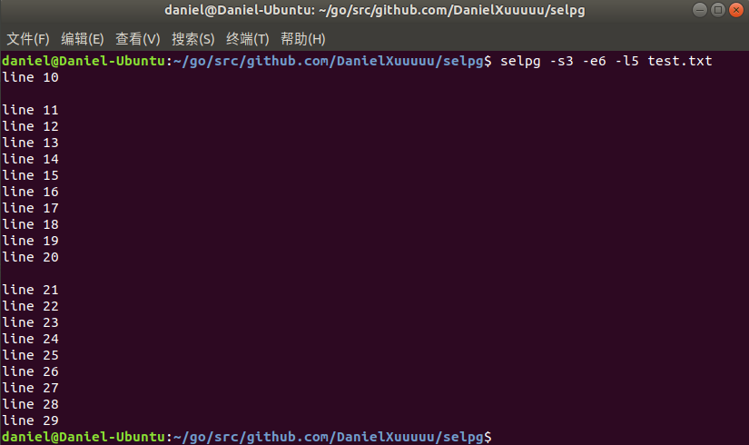
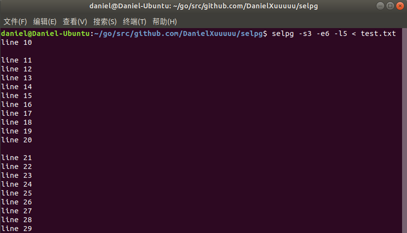
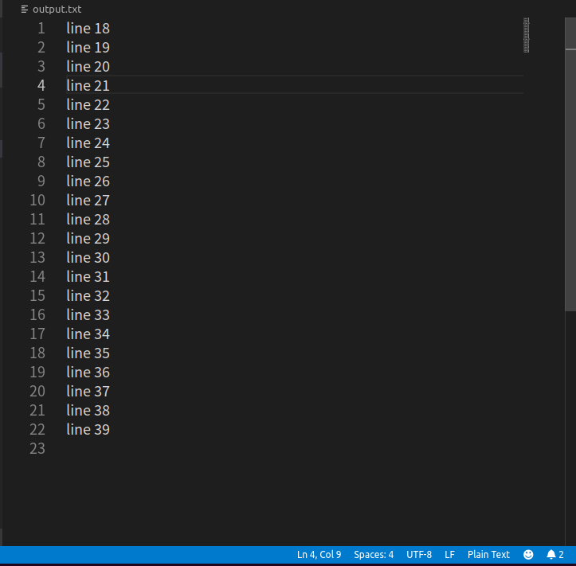
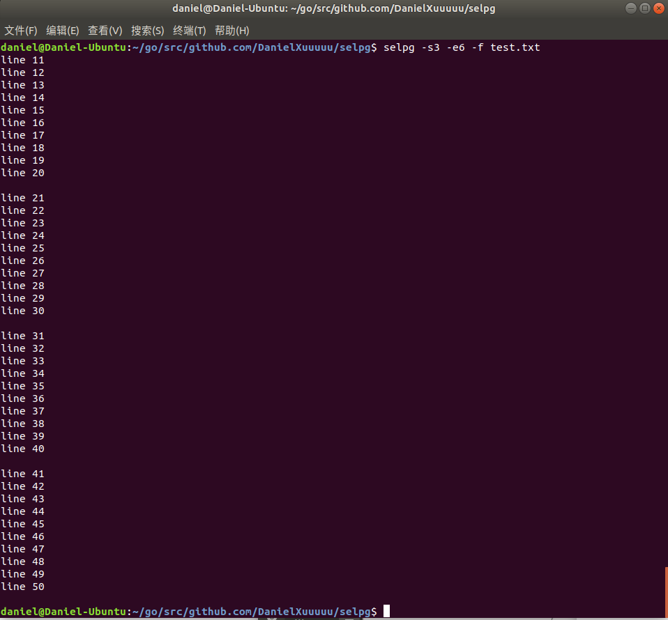

# 用Golang编写简单CLI程序—selpg

> C语言实现版本：[selpg.c](https://www.ibm.com/developerworks/cn/linux/shell/clutil/selpg.c)
>
> 参考文档：[开发 Linux 命令行实用程序](https://www.ibm.com/developerworks/cn/linux/shell/clutil/index.html)
>
> [Go Online分享链接](http://139.9.57.167:20080/share/bmm3j8676kvmo1a883t0?secret=false)

#### selpg简介

selpg 允许用户指定从输入文本抽取的页的范围，这些输入文本可以来自文件或另一个进程。

#### 实验过程

>  程序思路基本上参照C语言实现的版本

##### 安装pflag

按照题目要求，通过以下命令安装好Pflag包。

`go get github.com/spf13/pflag`

Pflag是第三方提供的处理命令行参数的库，相比于Golang标准库提供的flag包，Pflag具有更强大的功能，并且与标准的兼容性更好。该包的具体用法在下文会提到。

##### 导入所需包

```go
import(
	"fmt"
	"os"
	"os/exec"
	"bufio"
	"io"
	flag "github.com/spf13/pflag"
)
```

##### 结构体定义

用于保存执行命令时的参数信息。分别定义了起始和结束页号、页的行数、页的类型、以及输入文件和输出源。其中，除了起始页和结束页号，其他参数在执行命令时都是可选的。

```go
type selpg_args struct{
	start_page int
	end_page int
	page_len int 
	page_type string  
	in_filename string
	print_dest string
}
type sp_args selpg_args
```

##### 主程序

主程序比较简单，首先获取程序名，然后使用initPflag保存参数信息，然后解析并处理输入即可，具体函数会在下面讲到。

```go
func main(){
	var sa sp_args
	progname = os.Args[0]
	
	initPflag(&sa)
	process_args(&sa)
	process_input(sa)
}
```

##### 具体函数

###### iniPflag

定义命令行参数对应的变量，将其与之前定义的结构体成员变量一一绑定，随后执行的Parse函数会解析命令行参数到对应的flag上。

```go
func initPflag(psa *sp_args){
	flag.Usage = usage
	flag.IntVarP(&psa.start_page, "start", "s", -1, "start page")
	flag.IntVarP(&(psa.end_page), "end", "e", -1, "end page")
	flag.IntVarP(&(psa.page_len), "len", "l", 72, "line number per")
	flag.StringVarP(&(psa.page_type), "type", "f","l", "'l' for lines-delimited, 'f' for form-feed-delimited. default is 'l'" )
	flag.StringVarP(&(psa.print_dest), "dest", "d", "", "print dest")
	flag.Lookup("type").NoOptDefVal = "f"
	flag.Parse()
}
```

###### usage

用于输出selpg的提示信息，该函数在用户错误输入指令时会调用，向用户解释selpg的具体用法。实际上Pflag自带有帮助信息，但是不是特别美观，所以我自己定义了一个。

```go
func usage(){
	fmt.Printf("\nUsage: \n\n")
	fmt.Printf("\t%s -sNumber -eNumber [ -f | -lNumber ] [ -dDestination] [ filename ]\n\n", progname)
	fmt.Printf("\t-sNumber\tStart from Page <Number>.\n")
	fmt.Printf("\t-eNumber\tEnd to Page <Number>.\n")
	fmt.Printf("\t-lNumber\tSpecify the number of line per page.Default is 72.\n")
	fmt.Printf("\t-f\t\t'f' for form-feed-delimited.Default is 'l'.(lines-delimited,)\n")
	fmt.Printf("\t-dDestination\t printer\n")
	fmt.Printf("\tfilename\tRead input from the file.Default stdin.(Control-D to end.)\n\n")
}
```

###### process_args

参数处理，对`Parse()`得到的参数检查其合法性，检查输入的方式是否符合要求，以及进行一些简单的逻辑判断，例如结束页号要大于起始页号等等，如果不符合要求就打印帮助信息，并终止进程。最后检查是否指定了输入文件。因为输入文件前没有flag，所以Pflag并没有对其解析，需要手动单独检查。

```go
func process_args(psa *sp_args) {
	if len(os.Args) < 3 {
		fmt.Fprintf(os.Stderr, "%s: not enough arguments\n", progname)
		flag.Usage()
		os.Exit(1)
	}

	if os.Args[1][0] != '-' || os.Args[1][1] != 's' {
		fmt.Fprintf(os.Stderr, "%s: 1st arg should be -sNumber\n", progname)
		flag.Usage()
		os.Exit(1)
	}

	INT_MAX := int(^uint(0) >> 1)

	if psa.start_page < 1 || psa.start_page > (INT_MAX - 1) {
		fmt.Fprintf(os.Stderr, "%s: invalid start page %d\n", progname, psa.start_page)
		flag.Usage()
		os.Exit(1)
	}

	if os.Args[2][0] != '-' || os.Args[2][1] != 'e' {
		fmt.Fprintf(os.Stderr, "%s: 2nd arg should be -eNumber\n", progname)
		flag.Usage()
		os.Exit(1)
	}

	if psa.end_page < 1 || psa.end_page > (INT_MAX - 1) ||  psa.end_page < psa.start_page{
		fmt.Fprintf(os.Stderr, "%s: invalid end page %d\n", progname, psa.end_page)
		flag.Usage()
		os.Exit(1)
	}


	if psa.page_len < 1 || psa.page_len > INT_MAX - 1 {
		fmt.Fprintf(os.Stderr, "%s: invalid page length %d\n", progname, psa.page_len)
		flag.Usage()
		os.Exit(1)
	}


	argLeft := flag.Args()
	if len(argLeft) > 0{
		_, err  := os.Stat(flag.Args()[0])
		if err != nil && os.IsNotExist(err){
			fmt.Fprintf(os.Stderr, "%s: the file <%s> doss not exist, please create it first\n", progname, flag.Args()[0])
			os.Exit(1)
		}
		psa.in_filename  = string(argLeft[0])
	}else{
		psa.in_filename = ""
	}
}
```

###### process_input

处理输入的函数，首先确定输入和输出。根据之前参数的解析情况，确定输入是来自文件还是标准输入，然后根据获取到的`print_dest`参数确定输出位置：文件、打印机还是标准输出。最后根据指定的页号和分页标准(固定行数或者文件分页符)进行读入和输出即可。

```go
func process_input(sa sp_args){
	cmd := &exec.Cmd{}

	//input
	var fin *os.File
	if len(sa.in_filename) == 0{
		fin = os.Stdin
	}else{
		var err error
		fin, err = os.Open(sa.in_filename)
		if err != nil{
			fmt.Fprintf(os.Stderr, "\n%s: could not open input file <%s>", progname, sa.in_filename)
			os.Exit(1)
		}
	}
	bufFin := bufio.NewReader(fin)

	//output
	var fout io.WriteCloser
	if len(sa.print_dest) == 0{
		fout = os.Stdout
	}else{
		cmd = exec.Command("cat") 
		var err error
		cmd.Stdout, err = os.OpenFile(sa.print_dest, os.O_APPEND|os.O_WRONLY, os.ModeAppend)
		if err != nil {
			fmt.Fprintf(os.Stderr, "\n%s: could not open file %s\n",
				progname, sa.print_dest)
			os.Exit(1)
		}
		
		//StdinPipe返回一个连接到command标准输入的管道pipe 
		fout, err = cmd.StdinPipe()
		if err != nil {
			fmt.Fprintf(os.Stderr, "\n%s: could not open pipe to \"lp -d%s\"\n",
				progname, sa.print_dest)
			os.Exit(1)
		}
		cmd.Start()
		defer fout.Close()
	}

	var line_ctr int
	var page_ctr int
	
	if sa.page_type == "l"{
		line_ctr = 0
		page_ctr = 1
		
		for {
			line, crc := bufFin.ReadString('\n')
			if crc != nil{
				break
			}
			line_ctr += 1
			if line_ctr > sa.page_len{
				page_ctr +=1
				line_ctr = 1
			}
			if (page_ctr >= sa.start_page) && (page_ctr <= sa.end_page){
				_, err := fout.Write([]byte(line))
				if err != nil{
					fmt.Println(err)
					os.Exit(1)
				}
			}
		}
	}else{
		page_ctr = 1
		for{
			page,  err := bufFin.ReadString('\f')
			if err != nil{
				break
			}
			if (page_ctr >= sa.start_page) && (page_ctr <= sa.end_page){
				_, err := fout.Write([]byte(page))
				if err != nil{
					os.Exit(1)
				}
			}
			page_ctr += 1
		}
	}

	if page_ctr < sa.start_page{
		fmt.Fprintf(os.Stderr, "\n%s: start_page (%d) greater than total pages (%d), "+
		" no output written\n", progname, sa.start_page, page_ctr)
	}else if page_ctr < sa.end_page{
		fmt.Fprintf(os.Stderr,"\n%s: end_page (%d) greater than total pages (%d),"+
		" less output than expected\n", progname, sa.end_page, page_ctr);
	}
}
```

#### 程序测试

###### 使用程序生成测试文件

测试文件：`testFile_generator/generateTestFile.go`

该程序会在当前文件夹下生成test.txt文件，其中包含500行字符串，每隔10行有'\f'分页符

###### 运行

`selpg`的运行参数如下：

`selpg -sNumber -eNumber [-lNumber/-f] [-dDestination] [filename]`，具体含义使用命令`selpg -h`即可查看

运行方式：在selpg文件夹中执行`go install`命令后，即可在命令行中使用selpg命令

###### 测试

> selpg -s3 -e6 -l5 test.txt



> selpg -s3 -e6 -l5 < test.txt



> selpg -s10 -e20 -l2 test.txt > output.txt



> selpg -s3 -e6 -f test.txt



上述测试均通过，程序正确。