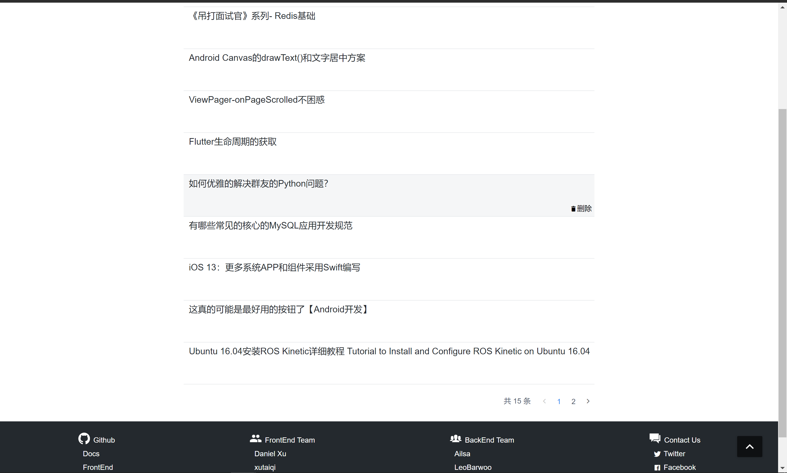

## 简单 web 服务与客户端开发实战

>本次作业实现了一个简单但较为完整的博客系统，后端使用Golang，前端使用Vue.js框架
>
>实现功能：用户登录、文章列表页进行文章管理，以及具体文章页，并可以进行评论
>
>本人分工：前端
>
>项目地址：[Github](https://github.com/SYSU-SimpleBlog)

### 开发流程

开发流程遵循API First的开发理念，并实现前后端分离，总体流程如下：

+ 确定要实现的功能，并完成对应的后端接口API设计；
+ 使用Swagger工具，编写API文档，并自动生成前后端api的一些实现；
+ 使用Github建立组织，前后端组员建立各自的仓库并基于API文档进行同步开发，过程中对于一些前期设计不合理的地方进行调整，修改API文档；
+ 前后端独立测试完毕后进行代码对接，并解决出现的Bug。

应该说整个流程还是比较清晰的。

### API设计

API的设计遵循RESTful风格，共实现以下API：

```/
用户登录：/user/signin
登录用户获取文章列表：/user/articles
根据文章id获取文章信息：/user/article/{id}
删除文章：/user/deleteArticle/{id}
获取文章评论：/user/article/{id}/comments
添加评论：/user/article/{id}/comment
```

具体API说明见[API文档](https://sysu-simpleblog.github.io/Proj-doc/#api-Comment-createComment)

上述链接中API文档页面由[Swagger](http://editor.swagger.io/)生成，该工具还能帮我们生成一些前后端代码，其中前端使用了[swagger-vue](https://github.com/chenweiqun/swagger-vue)工具，该工具可以帮助我们由json格式的API文档生成可供直接调用的Axios请求，省去了不少的前期工作。

### 前端开发

我在项目中主要负责的是前端的实现，而前端总体而言并不难，说简单点其实就是写几个页面，调用一下API得到数据后显示在该显示的位置而已。

前端项目主要使用了目前比较主流的`Vue.js`框架，参考网上的方式搭建好后就可以开始编写了，在`Vue.js`中，页面主要由单文件组件构成，同时使用`Vue Router`实现跳转即可。

至于`Vue`的一些语法，可以看[Vue官网](https://cn.vuejs.org/)的官网，我也是初学者，并不是十分熟练，在这里就不展开介绍`Vue`项目的具体实现了。

#### Mock服务

前期由于后端API的开发未完成，而前端进度比较快，又需要数据进行测试，虽然可以写静态页面并自己填上去一些假数据，但到了后面就少不了要更改代码。此时就需要使用Mock服务进行模拟API并返回一些假数据了，这也是实现前后端分离开发的关键所在，通过模拟数据使得前后端实现解耦。

在本次项目中，前端使用`mockjs`实现mock数据，通过`npm install mockjs --save-dev`命令安装好后引入项目，针对要测试的API及其API文档约定的返回内容编写相应的假数据即可，而等到后端一旦实现API服务，我们只需要注释掉`mockjs`的引入，并切换到上文提到的自动生成的api请求，就可以实现无缝切换。

具体的写法可以参考：[Vue+Mockjs，模拟接口数据，实现前后端独立开发](https://zhuanlan.zhihu.com/p/46396107)

### 前后端耦合

在后端也完成后，即开始进行使用后端实现的真正API进行测试，测试中也遇到了不少问题，主要的有以下方面：

#### 跨域问题

跨域请求的问题需要后端进行特殊处理：

```
	w.Header().Set("Content-Type", "application/json; charset=UTF-8")
	w.Header().Set("Access-Control-Allow-Methods","PUT,POST,GET,DELETE,OPTIONS")
	w.Header().Set("Access-Control-Allow-Headers", "X-Requested-With,Content-Type")
	w.Header().Set("Access-Control-Allow-Origin", "*")
	w.WriteHeader(http.StatusOK)
```

#### Token认证

根据作业加分项要求，我们实现了添加评论时需要进行用户Token认证的技术，用于认证用户的登陆信息，大致流程如下：

1. 客户端使用用户名跟密码请求登录
2. 服务端收到请求，去验证用户名与密码
3. 验证成功后，服务端会签发一个 Token，再把这个 Token 发送给客户端
4. 客户端收到 Token 以后可以把它存储起来，比如放在 Cookie 里或者 Local Storage 里
5. 客户端每次向服务端请求资源的时候需要带着服务端签发的 Token
6. 服务端收到请求，然后去验证客户端请求里面带着的 Token，如果验证成功，就向客户端返回请求的数据

因此，前端需要实现的是在登陆成功后保存返回的token，并在后续的请求中发送这个token。在本项目中，token被保存在cookie中，并在发送请求时加在请求头即可。

### 最终实现

最终实现效果如下：

#### 首页


#### 登录页


#### 文章列表页



#### 文章内容及评论页


在项目中，后端返回的文章内容格式采用了Markdown语法，但由于时间紧迫与经验不足，前端对于Markdown格式的支持并不十分到位，项目中暂时只支持文本的显示，对于一些图片及代码块的显示会比较混乱，且由于图片资源来自网络，有些图片会无法显示，有待以后的继续完善。